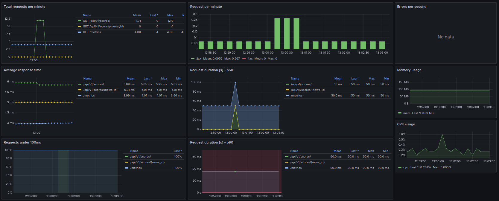

# EventScore
Микросервисы для оценки событий

### Стек
* [Redis](https://redis.io/)
* [FastApi](https://fastapi.tiangolo.com/)
* [Postgresql](https://postgrespro.ru/docs/postgresql/14/index)
* [Prometeus](https://prometheus.io/docs/introduction/overview/)
* [Grafana](https://grafana.com/)

## Установка

Зависимости:

* [Docker](https://docs.docker.com/get-docker/)
* [Docker-compose](https://docs.docker.com/compose/install/)

- [ ] Склонируйте репозиторий:
    ``` bash
    git clone https://github.com/DmitrySergeev-dev/EventScore.git
    ```
- [ ] Создайте два файла на основе шаблона `.env.template` (лежит в том же каталоге):
- `score-maker/.env`
- `line-provider/.env`

## Запуск

Запустите `docker compose`:

``` bash
docker-compose up --build -d
```
либо с помощью Makefile
``` bash
make start
```

Теперь у вас есть доступ к:

* Prometheus: http://0.0.0.0:9090/
* Grafana: http://0.0.0.0:3000/
* Сервис ScoreMaker: http://0.0.0.0:8556/
* Сервис LineProvider: http://0.0.0.0:8555/

Для сервиса ScoreMaker доступен дашбоард с метриками сервиса и его нагрузки на систему:

##### Как это выглядит сейчас

<p align="center">
  
</p>

## Ссылки

* [Prometheus FastAPI Instrumentator](https://github.com/trallnag/prometheus-fastapi-instrumentator)
* [Generate and Track Metrics for Flask API Applications Using Prometheus and Grafana](https://medium.com/swlh/generate-and-track-metrics-for-flask-api-applications-using-prometheus-and-grafana-55ddd39866f0)
* [PromQL for Humans](https://timber.io/blog/promql-for-humans/)